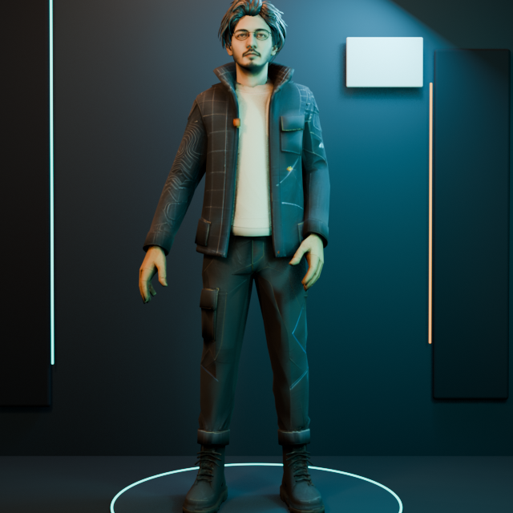

# Sadeq's Interactive 3D Digital Twin

A browser-based digital twin that combines authored character animation, continuous gesture blending, speech-driven lip movement, controlled AI context, microphone input, and resilient web fallbacks.



The visual system uses a paper-cut-inspired character treatment rather than a generic glossy avatar: layered fiber texture, an architectural studio, dimensional shadows, and controlled aqua-and-amber lighting connect it to the wider portfolio identity.

## Why this project exists

Most portfolio chatbots are detached widgets. This project explores a more coherent interface: the character's body performance, mouth movement, voice, camera and conversation state respond as one system.

The goal is not to simulate a human. It is to make a technical portfolio easier to explore while keeping the information grounded in a maintained professional profile.

## System capabilities

- Authored idle, greeting, start and explanation animations
- Dedicated transition clips for continuous gesture blending
- Three non-repeating speaking silhouettes
- Eight facial viseme targets
- Audio-energy and transcript-timing lip movement
- Text, browser speech recognition and recorded-audio transcription paths
- Controlled AI context built from a professional source of truth
- WebGL, microphone, transcription and audio fallbacks
- Responsive rendering and reduced-motion support

## Architecture

```text
Text / microphone
        |
        v
Browser recognition ---- recorded-audio transcription fallback
        |                               |
        +---------------+---------------+
                        v
             controlled AI context
                        |
                        v
                generated response
                  /             \
                 v               v
          speech playback     chat transcript
                 |
                 v
      audio analysis + transcript timing
                 |
        +--------+---------+
        v                  v
 facial visemes      blended body gestures
```

## Animation state model

```text
Idle
  |
  +-- first greeting --> Hi --> Start --> Explain 1 --> Explain 2
  |
  +-- later response --> randomized non-repeating transition cycle
                         Start <--> Explain 1 <--> Explain 2
  |
  +-- speech ends ----> Idle
```

The runtime does not jump directly between unrelated poses. Exported transition clips bridge every speaking-state combination, while Three.js cross-fades between active actions.

## Technology

- Three.js and WebGL
- GLTF/GLB skeletal animation and morph targets
- Web Speech API
- MediaRecorder API
- Gemini through serverless functions
- Netlify Functions
- Vanilla JavaScript, HTML and CSS

## Run locally

The model and JavaScript modules require an HTTP server; opening `index.html` directly will not work reliably.

```bash
npx serve .
```

Then open the local URL shown in the terminal.

## Rebuild the optimized web model

The checked-in GLB is prepared in two stages: texture resizing through Blender, followed by lossless animation cleanup and Meshopt compression.

```bash
blender --background --python tools/prepare_web_glb.py -- source.glb prepared.glb 1024
npx @gltf-transform/cli optimize prepared.glb assets/sadeq-digital-twin.meshopt.glb --compress meshopt --meshopt-level high --flatten false --join false --palette false --simplify false --texture-compress false
```

Validate the animation names and morph targets after every rebuild before replacing the published asset.

The public demo currently uses the deployed portfolio API. To run your own AI and transcription backend, deploy the included Netlify functions and change the two API constants in `mascot.js`.

## Environment variables

The serverless functions require provider credentials. Keep them in the deployment platform and never commit them.

Refer to the function source for the currently supported environment-variable names.

## Performance decisions

- Texture preparation and Meshopt compression reduce the web GLB from 22.6 MB to approximately 4.1 MB while preserving the rig, morph targets and all 13 animation clips.
- The 3D model loads only when the interactive viewer opens.
- Mobile rendering uses a lower pixel ratio and disables expensive shadows.
- Renderer resizing is observed instead of continuously polling layout.
- Mouth shapes are smoothed to avoid visual chatter.
- The text interface remains usable while the model loads or if WebGL fails.
- Reduced-motion preferences disable non-essential interface animation.

The GLB remains the largest asset. Further texture or geometry reduction should only ship after visual comparison confirms that it preserves the face, papercut material treatment and animation quality.

## Privacy and limitations

- Microphone recordings are used only to transcribe the current question.
- AI responses can be incorrect and should not be treated as Sadeq speaking personally.
- The assistant is restricted to a maintained professional knowledge source.
- Browser speech and microphone behavior varies by browser and permission state.

## Asset provenance

See [ASSET_NOTES.md](ASSET_NOTES.md) for the distinction between authored engineering, adapted animation assets and AI-assisted visual work.

## Author

**Sadeq Rezai** — Configuration Consultant working across quality engineering, automated validation, data, web systems and practical AI.

- [Engineering portfolio](https://rammeshgar.github.io)
- [LinkedIn](https://www.linkedin.com/in/sadeqrezai)
- [GitHub](https://github.com/Rammeshgar)

## License

Source code is available under the [MIT License](LICENSE). The character model and visual identity assets are excluded from that license; see [ASSET_NOTES.md](ASSET_NOTES.md).
